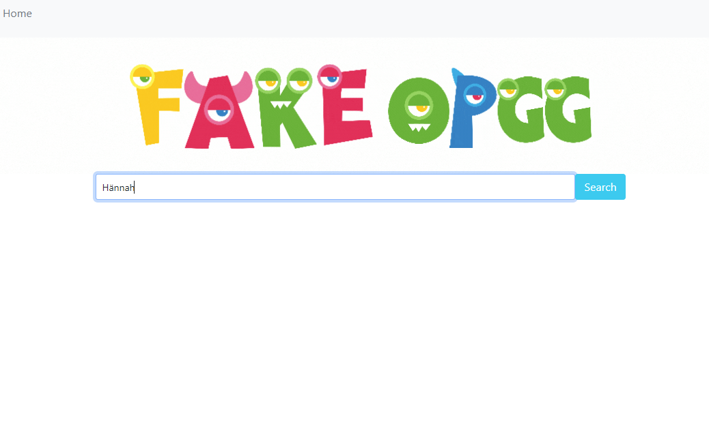
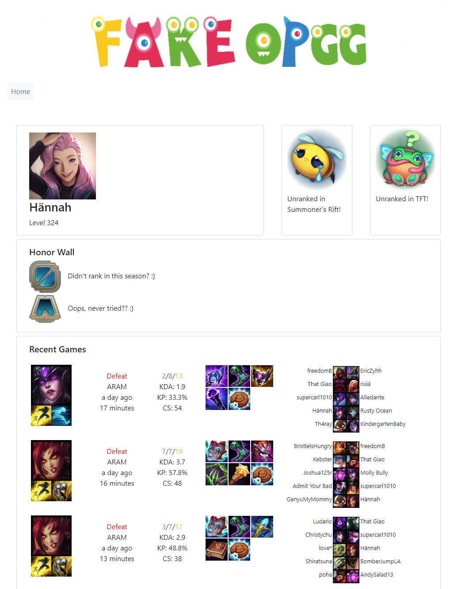

# CheckMyFriend

## Overview
A real-time search engine for League of Legend players' account details.
One search at a time.
Imitating the functionality of the famous OP.GG app.

## Side Note
```md
At the current time, I am still trying to use build a Node.js proxy server to secure the private API key. 
Thus the project is not online yet. 
Feel free to check out the demo below though! They are all the functions this app provides.
```

## Demo
```md 
As a user, I can type in summoner's name to pull out account details.
```


```md 
Then I can be redirected to a detailed page of various important information of the searched summoner.
Such as account level, icon, rank, match history, etc.
```



